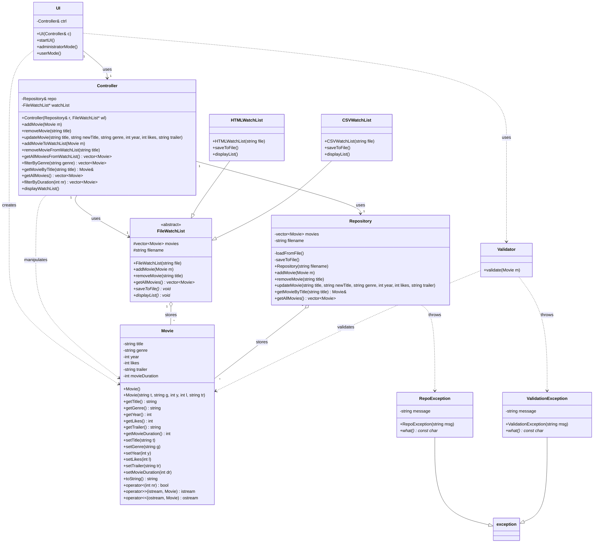

# Local Movie Database - UML Class Diagram

```mermaid
classDiagram
    class Movie {
        -string title
        -string genre
        -int year
        -int likes
        -string trailer
        -int movieDuration
        +Movie()
        +Movie(string t, string g, int y, int l, string tr)
        +getTitle() string
        +getGenre() string
        +getYear() int
        +getLikes() int
        +getTrailer() string
        +getMovieDuration() int
        +setTitle(string t)
        +setGenre(string g)
        +setYear(int y)
        +setLikes(int l)
        +setTrailer(string tr)
        +setMovieDuration(int dr)
        +toString() string
        +operator<(int nr) bool
        +operator>>(istream, Movie) istream
        +operator<<(ostream, Movie) ostream
    }

    class ValidationException {
        -string message
        +ValidationException(string msg)
        +what() const char*
    }

    class Validator {
        +validate(Movie m)
    }

    class RepoException {
        -string message
        +RepoException(string msg)
        +what() const char*
    }

    class Repository {
        -vector~Movie~ movies
        -string filename
        -loadFromFile()
        -saveToFile()
        +Repository(string filename)
        +addMovie(Movie m)
        +removeMovie(string title)
        +updateMovie(string title, string newTitle, string genre, int year, int likes, string trailer)
        +getMovieByTitle(string title) Movie&
        +getAllMovies() vector~Movie~
    }

    class FileWatchList {
        <<abstract>>
        #vector~Movie~ movies
        #string filename
        +FileWatchList(string file)
        +addMovie(Movie m)
        +removeMovie(string title)
        +getAllMovies() vector~Movie~
        +saveToFile()* void
        +displayList()* void
    }

    class CSVWatchList {
        +CSVWatchList(string file)
        +saveToFile()
        +displayList()
    }

    class HTMLWatchList {
        +HTMLWatchList(string file)
        +saveToFile()
        +displayList()
    }

    class Controller {
        -Repository& repo
        -FileWatchList* watchList
        +Controller(Repository& r, FileWatchList* wl)
        +addMovie(Movie m)
        +removeMovie(string title)
        +updateMovie(string title, string newTitle, string genre, int year, int likes, string trailer)
        +addMovieToWatchList(Movie m)
        +removeMovieFromWatchList(string title)
        +getAllMoviesFromWatchList() vector~Movie~
        +filterByGenre(string genre) vector~Movie~
        +getMovieByTitle(string title) Movie&
        +getAllMovies() vector~Movie~
        +filterByDuration(int nr) vector~Movie~
        +displayWatchList()
    }

    class UI {
        -Controller& ctrl
        +UI(Controller& c)
        +startUI()
        +administratorMode()
        +userMode()
    }

    ValidationException --|> exception
    RepoException --|> exception
    CSVWatchList --|> FileWatchList
    HTMLWatchList --|> FileWatchList

    Validator ..> Movie : validates
    Validator ..> ValidationException : throws

    Repository "1" o-- "*" Movie : stores
    Repository ..> RepoException : throws

    FileWatchList "1" o-- "*" Movie : stores

    Controller "1" --> "1" Repository : uses
    Controller "1" --> "1" FileWatchList : uses
    Controller ..> Movie : manipulates

    UI "1" --> "1" Controller : uses
    UI ..> Validator : uses
    UI ..> Movie : creates
```
